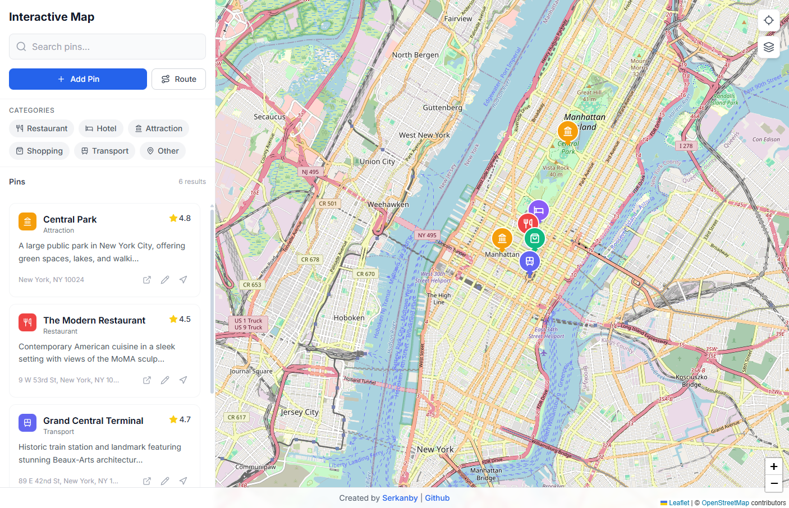
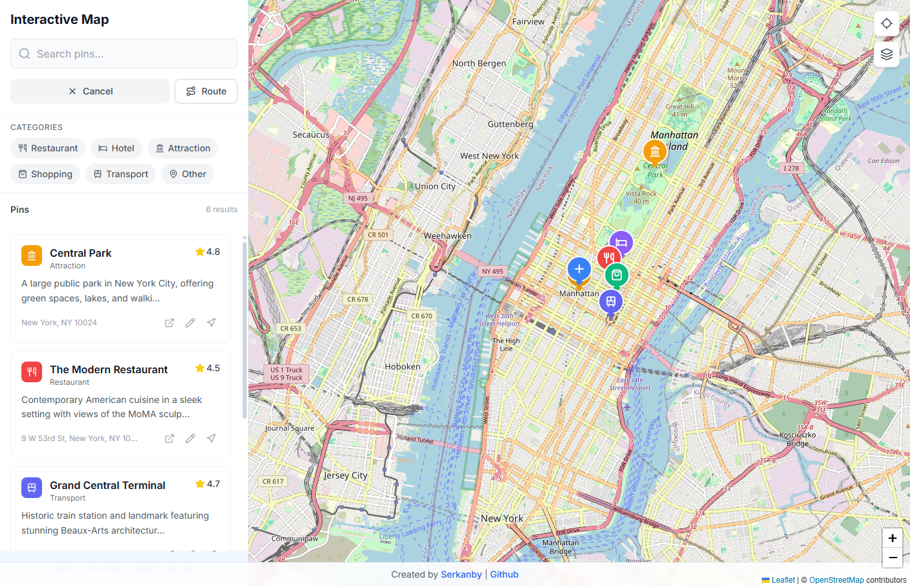
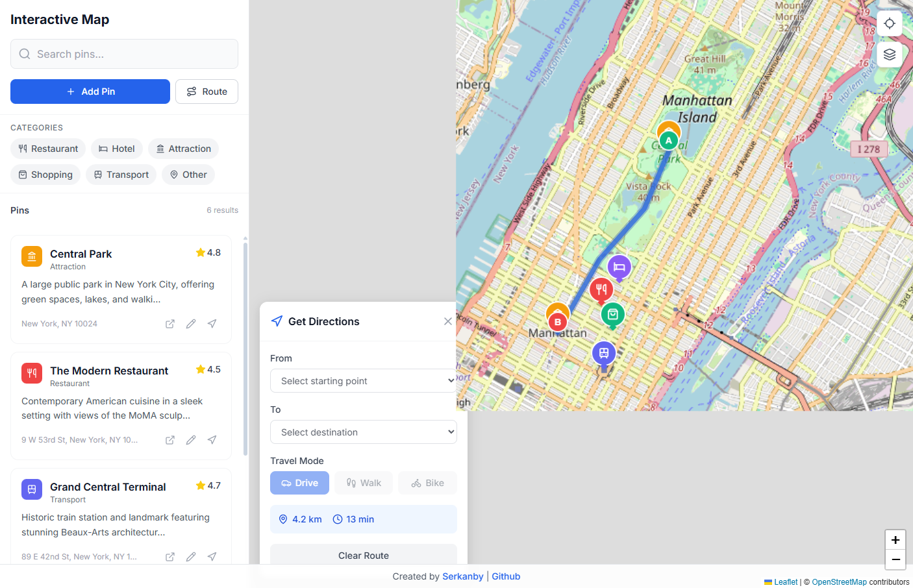

# 🗺️ Interactive Map

A modern, responsive interactive map application built with React, TypeScript, and Leaflet. Explore locations, manage custom pins with categories, search and filter places, and get route directions between points.

[](https://serkanbayraktar.com/)
[](https://github.com/Serkanbyx)
[](https://react.dev/)
[](https://www.typescriptlang.org/)
[](https://vitejs.dev/)
[](https://tailwindcss.com/)
[](LICENSE)

## Features

- **Interactive Map**: OpenStreetMap tiles with smooth pan, zoom, and click interactions for seamless exploration
- **Pin Management**: Add, view, edit, and delete location pins with custom details including title, description, address, and rating
- **Category System**: 6 distinct categories with custom icons and colors (Restaurant, Hotel, Attraction, Shopping, Transport, Other)
- **Search & Filter**: Real-time search by title, description, or address with category filtering support
- **Route Directions**: Get driving, walking, or cycling directions between any two pins via Mapbox Directions API
- **Responsive Design**: Fully responsive layout that works seamlessly on desktop, tablet, and mobile devices
- **Persistent Storage**: All pins are automatically saved to local storage for data persistence
- **Form Validation**: Robust form validation using Zod schema for reliable pin creation
- **Beautiful UI**: Modern, clean interface with Tailwind CSS styling and Lucide icons

## Live Demo

[🌐 View Live Demo](https://interactive-mappp.netlify.app/map)

## Screenshots

### Main Map View

The main interface displays an interactive map with a collapsible sidebar containing pin list, search functionality, and category filters.



### Pin Management

Click anywhere on the map to add a new pin. Fill in the details including title, description, category, and optional address.



### Route Directions

Select any two pins to calculate and display the route between them with distance and duration information.



## Technologies

- **React 18**: Modern React with hooks for building the user interface
- **TypeScript**: Type-safe development with full TypeScript support
- **Vite**: Lightning-fast build tool and development server
- **Zustand**: Lightweight state management for global app state
- **React Hook Form**: Performant form handling with minimal re-renders
- **Zod**: Schema validation for type-safe form validation
- **React Router v6**: Client-side routing for navigation
- **Leaflet + React-Leaflet**: Interactive map library with React bindings
- **OpenStreetMap**: Free map tiles for the base layer
- **Mapbox Directions API**: Route calculation and navigation
- **Tailwind CSS**: Utility-first CSS framework for styling
- **Lucide React**: Beautiful, consistent icon library
- **clsx + tailwind-merge**: Utility functions for conditional class names

## Installation

### Prerequisites

Make sure you have the following installed on your system:

- Node.js 18 or higher
- npm or yarn package manager

### Local Development

1. Clone the repository:

```bash
git clone https://github.com/Serkanbyx/interactive-map.git
cd interactive-map
```

2. Install dependencies:

```bash
npm install
```

3. Create environment file:

```bash
cp .env.example .env
```

4. (Optional) Add your Mapbox token for route directions:

```env
VITE_MAPBOX_ACCESS_TOKEN=your_mapbox_token_here
```

Get your free Mapbox token at: https://account.mapbox.com/access-tokens/

5. Start the development server:

```bash
npm run dev
```

6. Open http://localhost:5173 in your browser.

## Usage

1. **Explore the Map**: Pan and zoom around the map to explore different locations
2. **View Pins**: Click on any marker to view pin details in a popup
3. **Add a Pin**: Click the "Add Pin" button, then click anywhere on the map to place a new pin
4. **Fill Pin Details**: Enter title, description, select a category, and optionally add an address, image URL, and rating
5. **Edit a Pin**: Use the edit (pencil) action on a pin card, marker popup, or detail page to update its details
6. **Search Pins**: Use the search bar in the sidebar to find pins by name, description, or address
7. **Filter by Category**: Click category buttons to filter pins by type
8. **Get Directions**: Click the directions action on any pin (or open the Route panel) to plan a route to it
9. **Delete Pins**: Open a pin's detail page and use the delete button to remove it

## How It Works?

### State Management with Zustand

The application uses Zustand for efficient state management:

```typescript
interface PinState {
  pins: Pin[];                       // All map pins
  selectedPin: Pin | null;           // Currently selected pin
  editingPin: Pin | null;            // Pin currently being edited
  routeDestinationPin: Pin | null;   // Pin requested as a route destination
  routeData: RouteData | null;       // Active route data
  filters: FilterState;              // Search and category filters
  isAddingPin: boolean;              // Pin creation mode
}
```

### Pin Data Structure

Each pin contains the following information:

```typescript
interface Pin {
  id: string;
  title: string;
  description: string;
  category: PinCategory;
  coordinates: { lat: number; lng: number };
  address?: string;
  rating?: number;
  createdAt: string;
  updatedAt: string;
}
```

### Route Calculation

Routes are calculated using the Mapbox Directions API and decoded using the polyline algorithm for display on the map.

## Project Structure

```
src/
├── components/
│   ├── layout/         # Layout components (MobileNav)
│   ├── map/            # Map components (Map, Markers, RouteLine)
│   ├── pin/            # Pin components (PinForm, PinCard)
│   ├── route/          # Route components (RoutePanel)
│   ├── sidebar/        # Sidebar components (Sidebar, Filters)
│   └── ui/             # Reusable UI components (Button, Input, etc.)
├── data/               # Seed/demo data (samplePins)
├── hooks/              # Custom React hooks
├── lib/                # Utility functions
├── pages/              # Page components
├── schemas/            # Zod validation schemas
├── services/           # API services (Mapbox)
├── store/              # Zustand store
├── types/              # TypeScript types
├── App.tsx             # Main app component
├── main.tsx            # Entry point
└── index.css           # Global styles
```

## Build Guide

A step-by-step build playbook documenting how this project was assembled (phases, steps, and acceptance criteria) is available at [docs/build-guide.md](docs/build-guide.md).

## Available Scripts

| Command | Description |
|---------|-------------|
| `npm run dev` | Start development server |
| `npm run build` | Build for production |
| `npm run preview` | Preview production build |
| `npm run lint` | Run ESLint for code quality |

## Customization

### Add Your Own Categories

Edit the `src/types/index.ts` file to add new categories:

```typescript
export const CATEGORIES: CategoryMeta[] = [
  { id: 'restaurant', label: 'Restaurant', color: '#ef4444', icon: 'utensils' },
  { id: 'hotel', label: 'Hotel', color: '#8b5cf6', icon: 'bed' },
  // Add your custom category here
  { id: 'museum', label: 'Museum', color: '#0ea5e9', icon: 'building-2' },
];
```

### Change Map Center

Modify the default map center in `src/components/map/Map.tsx`:

```typescript
const DEFAULT_CENTER: [number, number] = [40.7128, -74.0060]; // New York
const DEFAULT_ZOOM = 13;
```

### Customize Theme Colors

Update Tailwind configuration in `tailwind.config.js` to change the color scheme.

## Environment Variables

| Variable | Required | Description |
|----------|----------|-------------|
| `VITE_MAPBOX_ACCESS_TOKEN` | Optional | Mapbox API token for route directions |
| `VITE_API_BASE_URL` | Future | Backend API URL (for future integration) |

## Browser Support

- Chrome 90+
- Firefox 88+
- Safari 14+
- Edge 90+

## Features in Detail

### Completed Features

✅ Interactive map with pan and zoom  
✅ Pin CRUD operations (Create, Read, Update, Delete)  
✅ 6 category types with custom icons and colors  
✅ Real-time search functionality  
✅ Category filtering  
✅ Route directions via Mapbox API  
✅ Responsive mobile-first design  
✅ Local storage persistence  
✅ Form validation with Zod  
✅ Clean, modern UI with Tailwind CSS  

### Future Features

- [ ] User authentication and accounts
- [ ] Backend API integration
- [ ] Pin sharing and collaboration
- [ ] Import/export pins as JSON or CSV
- [ ] Custom map tile providers
- [ ] Offline mode support
- [ ] Pin clustering for better performance
- [ ] Image upload for pins

## Contributing

Contributions are welcome! Please follow these steps:

1. Fork the repository
2. Create your feature branch:

```bash
git checkout -b feature/amazing-feature
```

3. Commit your changes with semantic commit messages:

```bash
git commit -m 'feat: add amazing feature'
```

**Commit Message Prefixes:**

| Prefix | Description |
|--------|-------------|
| `feat:` | New feature |
| `fix:` | Bug fix |
| `docs:` | Documentation changes |
| `style:` | Code style changes (formatting, etc.) |
| `refactor:` | Code refactoring |
| `test:` | Adding or updating tests |
| `chore:` | Maintenance tasks |

4. Push to the branch:

```bash
git push origin feature/amazing-feature
```

5. Open a Pull Request

## License

This project is licensed under the MIT License - see the [LICENSE](LICENSE) file for details.

## Developer

**Serkanby**

- 🌐 Website: [serkanbayraktar.com](https://serkanbayraktar.com/)
- 💻 GitHub: [@Serkanbyx](https://github.com/Serkanbyx)
- 📧 Email: serkanbyx1@gmail.com

## Acknowledgments

- [OpenStreetMap](https://www.openstreetmap.org/) - Free map tiles
- [Mapbox](https://www.mapbox.com/) - Directions API
- [Leaflet](https://leafletjs.com/) - JavaScript map library
- [React-Leaflet](https://react-leaflet.js.org/) - React components for Leaflet
- [Lucide](https://lucide.dev/) - Beautiful icon library
- [Tailwind CSS](https://tailwindcss.com/) - Utility-first CSS framework
- [Zustand](https://zustand-demo.pmnd.rs/) - State management library

## Contact

- 📝 Issues: [GitHub Issues](https://github.com/Serkanbyx/interactive-map/issues)
- 📧 Email: serkanbyx1@gmail.com
- 🌐 Website: [serkanbayraktar.com](https://serkanbayraktar.com/)

---

⭐ If you like this project, don't forget to give it a star!
