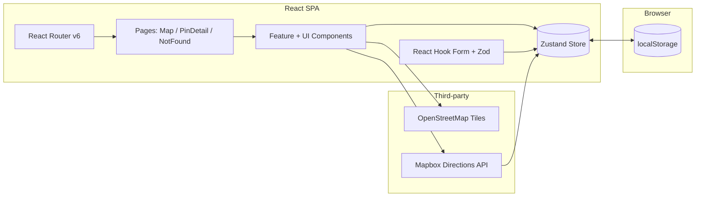

# Interactive Map — Step-by-Step Build Guide

> **Archived: original build playbook.** This document is the original roadmap used to build the Interactive Map application. It captures the intended implementation order, conventions, and acceptance criteria for each step. The codebase may have evolved since this guide was written, so for the current setup, architecture, and deployment notes, always defer to [../README.md](../README.md).

---

> **Project Summary:** Interactive Map is a client-side mapping application that lets users explore an OpenStreetMap-based map, manage location pins with full CRUD (create, read, update, delete), categorize them across six types with custom icons and colors, search and filter pins in real time, and plan routes between pins using the Mapbox Directions API. All data persists to the browser via `localStorage`, so the app runs without a backend. The stack is built around type safety (TypeScript + Zod), a single lightweight global store (Zustand), performant forms (React Hook Form), and a utility-first design system (Tailwind CSS + Lucide icons).

Each step below is a self-contained prompt. Execute them in order.

Stack: React 18, TypeScript 5, Vite 5, React Router v6, Zustand, React Hook Form, Zod, Leaflet + React-Leaflet, OpenStreetMap tiles, Mapbox Directions API, `@mapbox/polyline`, Tailwind CSS, Lucide React, clsx + tailwind-merge.

---

## Table of Contents

**PHASE 1 — Project Foundation**

- STEP 1 — Project Scaffolding & Dependency Setup
- STEP 2 — Tooling Configuration (Vite, TypeScript, Tailwind, ESLint)

**PHASE 2 — Domain Core**

- STEP 3 — Domain Types & Category Metadata
- STEP 4 — Zod Validation Schemas
- STEP 5 — Utility Library
- STEP 6 — Mapbox Directions Service
- STEP 7 — Demo Seed Data
- STEP 8 — Zustand Store

**PHASE 3 — UI Primitives**

- STEP 9 — Reusable UI Components

**PHASE 4 — Feature Components**

- STEP 10 — Map Surface & Layers
- STEP 11 — Markers, Click Handler & Route Line
- STEP 12 — Pin Form & Pin Card
- STEP 13 — Sidebar, Filters & Route Panel
- STEP 14 — Mobile Navigation

**PHASE 5 — Pages, Routing & Deploy**

- STEP 15 — Routing & Page Composition
- STEP 16 — Global Styles & Animations
- STEP 17 — Quality Gates & Production Build

**Appendices**

- Appendix A — Shared Constants
- Appendix B — Reusable Patterns
- Appendix C — Common Pitfalls
- Appendix D — Pre-flight Checklist

---

## Global Build Rules (apply to EVERY step)

- **No git operations.** Do not run `git` commands, do not commit, do not push, and do not create branches. Version control is handled manually by the user.
- Do not install unapproved packages. Only add a dependency when a step explicitly requires it, and prefer native methods first.
- Do not run long-running processes (dev servers, watchers) unless the user requests it.
- Treat every step as self-contained: it states its goal, the files to touch, and the acceptance criteria.
- Write clean, readable, English-named code using `camelCase` for variables and functions.
- Prefer modern syntax (ES6+, React Hooks, `async/await`).
- Keep code reusable and DRY; extract shared logic into `lib/`, `ui/`, or the store.
- Treat security, accessibility (a11y), and performance as first-class requirements in every step.
- After substantive edits, run the lint and typecheck gates from STEP 17.

---

## Architecture at a Glance



- The **Zustand store** is the single source of truth for pins, filters, selection, editing, and route state. It uses the `persist` middleware to mirror `pins` and `filters` into `localStorage`, and `devtools` for inspection.
- **Leaflet/React-Leaflet** renders the map and markers using free OpenStreetMap tiles.
- **Mapbox Directions API** is the only networked dependency; it is optional and gracefully degrades when no token is configured. Encoded polylines are decoded with `@mapbox/polyline`.
- **React Hook Form + Zod** drive the create/edit pin form with schema-based validation.

---

# PHASE 1 — PROJECT FOUNDATION

---

## STEP 1 — Project Scaffolding & Dependency Setup

**Goal:** Create a Vite + React + TypeScript project and install runtime and dev dependencies.

**Files/folders:** `package.json`, `index.html`, `src/main.tsx`, `public/`.

**Dependencies (runtime):** `react`, `react-dom`, `react-router-dom`, `zustand`, `react-hook-form`, `@hookform/resolvers`, `zod`, `leaflet`, `react-leaflet`, `@mapbox/polyline`, `lucide-react`, `clsx`, `tailwind-merge`.

**Dependencies (dev):** `typescript`, `vite`, `@vitejs/plugin-react`, `@types/react`, `@types/react-dom`, `@types/leaflet`, `@types/mapbox__polyline`, `tailwindcss`, `postcss`, `autoprefixer`, `eslint`, `eslint-plugin-react-hooks`, `eslint-plugin-react-refresh`, `@typescript-eslint/eslint-plugin`, `@typescript-eslint/parser`.

**Scripts:** `dev` (`vite`), `build` (`tsc && vite build`), `lint` (`eslint . --ext ts,tsx --report-unused-disable-directives --max-warnings 0`), `preview` (`vite preview`).

**Acceptance:** `npm install` completes; `index.html` mounts `#root` and loads `src/main.tsx` as a module.

---

## STEP 2 — Tooling Configuration

**Goal:** Configure Vite, TypeScript, Tailwind, PostCSS, and ESLint.

**Files/folders:** `vite.config.ts`, `tsconfig.json`, `tsconfig.node.json`, `tailwind.config.js`, `postcss.config.js`, `.eslintrc.cjs`, `.env.example`, `.gitignore`, `src/vite-env.d.ts`.

**Implementation notes:**

- Add the `@` path alias to both Vite (`resolve.alias`) and TypeScript (`paths`), pointing to `./src`.
- Enable production source maps in the Vite `build` config.
- Configure Tailwind `content` globs for `index.html` and `src/**/*.{ts,tsx}`. Define a `primary` color scale plus custom shadows (`card`, `card-hover`, `popup`) and keyframe animations (`slide-up`, `pulse-marker`) used by the UI.
- ESLint extends the recommended TypeScript and React Hooks configs; keep `--max-warnings 0` so warnings fail CI.
- `.env.example` documents `VITE_MAPBOX_ACCESS_TOKEN` (optional) and `VITE_API_BASE_URL` (future). Ensure `.env` is git-ignored.

**Security/perf:** Never hardcode tokens; read them from `import.meta.env`. The Mapbox token is a public client token — restrict it by URL in the Mapbox dashboard.

**Acceptance:** `npm run dev` serves the app; `@/...` imports resolve in both editor and build.

---

# PHASE 2 — DOMAIN CORE

---

## STEP 3 — Domain Types & Category Metadata

**Goal:** Define the shared TypeScript contracts for the whole app.

**Files:** `src/types/index.ts`.

**Implementation notes:**

- Export `PinCategory` as a string union of the six categories, `Coordinates`, `Pin`, `PinFormData`, `FilterState`, `RouteWaypoint`, `RouteData`, `RouteStep`, `MapViewState`, and `CategoryMeta`.
- `Pin` includes `id`, `title`, `description`, `category`, `coordinates`, optional `address`, `imageUrl`, `rating`, and `createdAt`/`updatedAt` timestamps.
- Export the `CATEGORIES: CategoryMeta[]` constant (id, label, color, icon name) and a `getCategoryMeta(category)` helper that falls back to `other`. See Appendix A.

**Acceptance:** Types compile and are importable via `@/types`.

---

## STEP 4 — Zod Validation Schemas

**Goal:** Provide runtime validation for forms and data integrity.

**Files:** `src/schemas/pin.schema.ts`.

**Implementation notes:**

- `pinCategorySchema` is a `z.enum` mirroring `PinCategory`.
- `coordinatesSchema` validates `lat` (-90..90) and `lng` (-180..180) with explicit messages.
- `pinFormSchema` validates `title` (2-100), `description` (10-500), `category`, `lat`, `lng`, optional `address` (<=200), optional `imageUrl` (valid URL or empty), and optional `rating` (0-5 number).
- `pinSchema` extends `pinFormSchema` with `id` (uuid), `createdAt`/`updatedAt` (datetime).
- Export inferred types `PinFormInput`, `PinInput`, `RouteRequest`.

**Validation:** The form must use `zodResolver(pinFormSchema)`. Numeric inputs convert empty strings to `undefined` via `setValueAs` so optional numbers validate correctly.

**Acceptance:** Submitting invalid data surfaces field-level messages; valid data passes.

---

## STEP 5 — Utility Library

**Goal:** Centralize pure helper functions.

**Files:** `src/lib/utils.ts`.

**Implementation notes:** Implement `cn` (clsx + tailwind-merge), `generateId` (`crypto.randomUUID()`), `formatDistance`, `formatDuration`, `debounce`, `truncate`, `formatDate`, `isValidCoordinates`, and `calculateDistance` (Haversine). Keep all functions pure and side-effect free.

**Acceptance:** Helpers are unit-testable and have no external side effects.

---

## STEP 6 — Mapbox Directions Service

**Goal:** Encapsulate all Mapbox network access behind a typed service.

**Files:** `src/services/mapbox.service.ts`.

**Implementation notes:**

- Read the token from `import.meta.env.VITE_MAPBOX_ACCESS_TOKEN`; treat the placeholder `your_mapbox_token_here` as unconfigured and warn.
- `getDirections(origin, destination, profile)` builds the `directions/v5/mapbox/{profile}` request with `geometries=polyline`, `overview=full`, `steps=true`, parses the response into `RouteData`, and throws meaningful errors.
- `decodePolyline` wraps `@mapbox/polyline`. `isMapboxConfigured` exposes configuration status to the UI. `reverseGeocode` is optional and returns `null` when unavailable.

**Security:** Never log the token. Fail closed when unconfigured so routing UI is disabled rather than erroring.

**Acceptance:** With no token, `isMapboxConfigured()` is `false` and the route panel shows a configuration notice instead of crashing.

---

## STEP 7 — Demo Seed Data

**Goal:** Keep demo content decoupled from real user data.

**Files:** `src/data/samplePins.ts`.

**Implementation notes:** Export `samplePins: Pin[]` with six New York landmarks. Use valid UUID strings for `id` to satisfy `pinSchema`, and ISO datetime strings for timestamps. This module seeds the store on first launch only.

**Acceptance:** Importing `samplePins` provides ready-to-render demo pins without coupling to the store internals.

---

## STEP 8 — Zustand Store

**Goal:** Implement the single global store with persistence.

**Files:** `src/store/pinStore.ts`.

**Implementation notes:**

- State: `pins`, `selectedPin`, `editingPin`, `routeDestinationPin`, `routeData`, `filters`, `isAddingPin`, `pendingCoordinates`, `isSidebarOpen`, `isLoading`, `error`.
- Pin actions: `addPin`, `updatePin` (stamps `updatedAt`, syncs `selectedPin`), `deletePin` (clears selection if needed), `selectPin`, `setEditingPin`.
- Filter actions: `setSearchQuery`, `toggleCategory`, `setCategories`, `clearFilters`.
- UI actions: `setIsAddingPin` (always clears `pendingCoordinates`), `setPendingCoordinates`, `toggleSidebar`, `setSidebarOpen`.
- Route actions: `setRouteData`, `setRouteDestinationPin`, `clearRoute` (clears both route data and destination).
- Derived selectors: `getFilteredPins` (category + case-insensitive text match over title/description/address) and `getPinById`.
- Wrap with `devtools(persist(...))`. Set persist `name: 'interactive-map-storage'`, `version: 1`, and `partialize` to persist only `pins` and `filters`. Seed initial `pins` from `samplePins`.

**Performance:** Keep selectors cheap; derive filtered lists on demand rather than storing duplicate state.

**Acceptance:** Pins survive reload; editing or deleting updates both list and selection consistently.

---

# PHASE 3 — UI PRIMITIVES

---

## STEP 9 — Reusable UI Components

**Goal:** Build the small, composable design-system primitives.

**Files:** `src/components/ui/` — `Button.tsx`, `Input.tsx`, `Textarea.tsx`, `Select.tsx`, `CategoryIcon.tsx`, `SearchInput.tsx`, `ConfirmDialog.tsx`, `Footer.tsx`, and a barrel `index.ts`.

**Implementation notes:**

- Use `forwardRef` for form controls (`Button`, `Input`, `Textarea`, `Select`) so React Hook Form can register them.
- `Button` supports `variant` (primary, secondary, ghost, danger, outline), `size` (sm, md, lg), and an `isLoading` spinner; it disables while loading.
- `CategoryIcon` maps each `PinCategory` to a Lucide icon. Export only the component from this file (avoid mixing non-component exports to satisfy `react-refresh`).
- `ConfirmDialog` is a controlled modal with `danger`/default variants for destructive confirmation.
- Inputs accept an `error` boolean to toggle red focus rings.

**A11y:** Every icon-only button needs `aria-label`; inputs pair with `<label htmlFor>`; focus-visible rings must be preserved.

**Acceptance:** Primitives render in isolation, forward refs, and pass lint with zero warnings.

---

# PHASE 4 — FEATURE COMPONENTS

---

## STEP 10 — Map Surface & Layers

**Goal:** Render the interactive map shell.

**Files:** `src/components/map/Map.tsx`, `MarkerIcons.tsx`, `MapControls.tsx`, and barrel `index.ts`.

**Implementation notes:**

- `Map` uses `MapContainer` with a default New York center/zoom, hides the default zoom control, and adds a custom `ZoomControl` at `bottomright`. The cursor switches to `crosshair` while in add-pin mode.
- `TileLayer` uses the OpenStreetMap URL with proper attribution.
- A `FlyToSelectedPin` inner component watches `selectedPin` and animates `map.flyTo` on change (guarding against re-fly on the same pin).
- `MarkerIcons.ts(x)` builds Leaflet `divIcon`s for category markers (colored), the temp marker, and route endpoints.
- `MapControls` adds locate-me (`map.locate`) and reset-view buttons positioned above the map with a high z-index.

**Performance:** Memoize marker icon creation per `(category, isSelected)`.

**Acceptance:** Map pans/zooms; selecting a pin flies to it; locate and reset controls work.

---

## STEP 11 — Markers, Click Handler & Route Line

**Goal:** Render pins, capture map clicks, and draw routes.

**Files:** `src/components/map/PinMarker.tsx`, `MapClickHandler.tsx`, `TempMarker.tsx`, `RouteLine.tsx`.

**Implementation notes:**

- `PinMarker` renders a category marker with a popup showing category badge, title, rating, truncated description, and actions: Details (navigate to detail page), Edit (`setEditingPin`), and Directions (`setRouteDestinationPin` + select). Clicking the marker selects the pin.
- `MapClickHandler` uses `useMapEvents` to set `pendingCoordinates` only when `isAddingPin` is true.
- `TempMarker` renders a marker at `pendingCoordinates` while placing a new pin.
- `RouteLine` decodes `routeData.geometry`, draws a styled `Polyline` (with a shadow line beneath), fits map bounds to the route, and places origin/destination markers.

**Acceptance:** Clicking the map in add mode drops a temp marker; routes render and frame correctly.

---

## STEP 12 — Pin Form & Pin Card

**Goal:** Create/edit pins and list them as cards.

**Files:** `src/components/pin/PinForm.tsx`, `PinCard.tsx`, barrel `index.ts`.

**Implementation notes:**

- `PinForm` accepts either `coordinates` (create mode) or `pin` (edit mode). It derives `isEditing`, prefills defaults from the pin when editing, and on submit calls `updatePin` or `addPin`. Title/button text switches between "Add New Pin"/"Save Pin" and "Edit Pin"/"Update Pin".
- The form includes title, category (with live color swatch + `CategoryIcon`), description, read-only-ish lat/lng numeric inputs, optional address, optional image URL, and optional rating. Register `rating` with `setValueAs` to coerce empty to `undefined`.
- `PinCard` shows the category icon/color, title, rating, truncated description, address, and action buttons: View details, Edit (`setEditingPin`), and Directions (`setRouteDestinationPin`). Card click selects the pin; action buttons call `stopPropagation`.

**A11y:** All action buttons carry `aria-label`/`title`; required fields are marked.

**Acceptance:** Creating and editing both persist; validation messages appear inline.

---

## STEP 13 — Sidebar, Filters & Route Panel

**Goal:** Compose search, filtering, listing, and routing UI.

**Files:** `src/components/sidebar/Sidebar.tsx`, `CategoryFilter.tsx`, `PinList.tsx`, `src/components/route/RoutePanel.tsx`, plus barrels.

**Implementation notes:**

- `Sidebar` holds the title, `SearchInput` bound to `setSearchQuery`, Add Pin / Cancel and Route buttons, `CategoryFilter`, and `PinList` with a live result count.
- `CategoryFilter` toggles categories via `toggleCategory`.
- `PinList` renders `getFilteredPins()` as `PinCard`s with an empty state.
- `RoutePanel` selects origin/destination pins, picks a travel profile (drive/walk/bike), calls `getDirections`, and shows distance/duration. It reads `routeDestinationPin` from the store to prefill the destination, then clears that flag. Closing the panel clears the destination flag. When Mapbox is unconfigured, controls disable and a notice shows.

**Acceptance:** Search/filter update the list instantly; clicking Directions on any pin opens the panel with that pin preselected as the destination.

---

## STEP 14 — Mobile Navigation

**Goal:** Provide a mobile-friendly bottom navigation.

**Files:** `src/components/layout/MobileNav.tsx`, barrel `index.ts`.

**Implementation notes:** Render a bottom bar (visible under `md`) with Menu (open sidebar), Add Pin (toggle), and a Pins count badge. Reuse store actions; do not duplicate state.

**Acceptance:** On small viewports the nav appears and controls the sidebar and add mode.

---

# PHASE 5 — PAGES, ROUTING & DEPLOY

---

## STEP 15 — Routing & Page Composition

**Goal:** Wire routes and compose the pages.

**Files:** `src/App.tsx`, `src/pages/MapPage.tsx`, `PinDetailPage.tsx`, `NotFoundPage.tsx`, barrel `index.ts`, `src/main.tsx`.

**Implementation notes:**

- `App` defines routes: `/` redirects to `/map`, `/map` renders `MapPage`, `/pin/:id` renders `PinDetailPage`, and `*` renders `NotFoundPage`. A persistent `Footer` sits below the routes.
- `MapPage` orchestrates the layout: responsive sidebar, map area, add-pin indicator, the pin form modal (open when `pendingCoordinates` OR `editingPin` is set), and the route panel (opened when `routeData` or `routeDestinationPin` exists). It tracks an `isMobile` flag via a resize listener.
- `PinDetailPage` reads the `:id` param, renders a mini map, full details, and header actions: Show on Map, Edit (sets `editingPin` then navigates to `/map`), and Delete (via `ConfirmDialog`). The bottom actions include Edit Pin and Get Directions (sets `routeDestinationPin` then navigates to `/map`).
- `main.tsx` wraps `App` in `BrowserRouter` and imports Leaflet CSS plus global styles.

**Acceptance:** All routes resolve; editing/directions from the detail page open the correct UI on the map page.

---

## STEP 16 — Global Styles & Animations

**Goal:** Establish base styles, Leaflet overrides, and shared animations.

**Files:** `src/index.css`.

**Implementation notes:** Import Tailwind layers. Add a custom scrollbar utility, popup styling overrides for Leaflet, and the `slide-up` / `pulse-marker` animations referenced by components. Keep global CSS minimal; prefer Tailwind utilities in components.

**Acceptance:** Animations and Leaflet popups render as designed; no layout shift on load.

---

## STEP 17 — Quality Gates & Production Build

**Goal:** Verify the project type-checks, lints clean, and builds.

**Commands:**

```bash
npm run lint
npx tsc --noEmit
npm run build
```

**Implementation notes:**

- `lint` must pass with zero warnings (the script enforces `--max-warnings 0`). Remove dead exports that trip `react-refresh/only-export-components`.
- `tsc --noEmit` must report no errors.
- `npm run build` runs `tsc` then `vite build`, emitting to `dist/`. A chunk-size advisory is acceptable; consider code-splitting later if needed.

**Acceptance:** All three commands succeed locally before any handoff.

---

# Appendix A — Shared Constants

Category metadata drives marker colors, icons, and labels across the app:

```typescript
export const CATEGORIES: CategoryMeta[] = [
  { id: 'restaurant', label: 'Restaurant', color: '#ef4444', icon: 'utensils' },
  { id: 'hotel', label: 'Hotel', color: '#8b5cf6', icon: 'bed' },
  { id: 'attraction', label: 'Attraction', color: '#f59e0b', icon: 'landmark' },
  { id: 'shopping', label: 'Shopping', color: '#10b981', icon: 'shopping-bag' },
  { id: 'transport', label: 'Transport', color: '#6366f1', icon: 'train' },
  { id: 'other', label: 'Other', color: '#6b7280', icon: 'map-pin' },
];
```

Default map view: center `[40.7580, -73.9855]` (New York), zoom `13`.

Persist key: `interactive-map-storage`, version `1`, persisting only `pins` and `filters`.

---

# Appendix B — Reusable Patterns

- **Single source of truth:** All cross-component state lives in the Zustand store. Components read via selectors and mutate via actions; never lift duplicate copies of pin state.
- **Class merging:** Always compose Tailwind classes with `cn(...)` so conditional and conflicting classes resolve predictably.
- **Form coercion:** For optional numeric inputs, register with `setValueAs` to turn empty strings into `undefined`, keeping Zod `.optional()` valid.
- **Graceful degradation:** Network features (routing) must detect missing configuration and disable UI with a clear notice rather than throwing.
- **Barrel exports:** Each component folder exposes an `index.ts` for clean `@/components/...` imports.

---

# Appendix C — Common Pitfalls

- **`react-refresh` warnings:** A file that exports a component must not also export unrelated non-component values; the lint gate fails on this. Move helpers elsewhere.
- **Leaflet control z-index:** Custom controls need a high z-index to sit above tiles and panes.
- **Re-fly loops:** Guard `flyTo` with a ref of the previous selected pin to avoid animating on unrelated re-renders.
- **Persisted demo data:** Seed pins are written to `localStorage` on first load; bump the persist `version` when changing the pin shape to enable future migrations.
- **PowerShell chaining:** On Windows PowerShell, chain commands with `;` (not `&&`).
- **UUID/schema mismatch:** Seed pins must use valid UUIDs and ISO datetimes to remain consistent with `pinSchema`.

---

# Appendix D — Pre-flight Checklist

- [ ] `npm install` completes without errors.
- [ ] `@/` alias resolves in editor and build.
- [ ] `npm run lint` passes with zero warnings.
- [ ] `npx tsc --noEmit` reports no errors.
- [ ] `npm run build` produces `dist/`.
- [ ] Pins persist across reloads; create/edit/delete all behave correctly.
- [ ] Search and category filtering update the list in real time.
- [ ] Directions action preselects the destination and opens the route panel.
- [ ] Route panel degrades gracefully without a Mapbox token.
- [ ] Layout is usable on mobile (bottom nav + collapsible sidebar).
- [ ] Icon-only controls have `aria-label`s.
